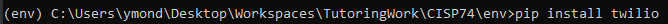

# Texting with Python

# What is Twilio?

[Source](https://www.twilio.com/the-current/what-is-twilio-how-does-it-work)

Twilio is a developer platform for communications. Twilio's programmable application program interfaces (APIs) are a set of tools developers can use to communicate using a python program or a program written in another programming language. While the API provides coverage for various communication protocols, including WhatsApp, email, etc., we will be using it for SMS.

## Why are we using Twilio?

[Source](https://stackoverflow.com/questions/12511070/build-an-own-sms-gateway)

Twilio cost money to use, but they do offer a free trial and account to test their services with. In your programming career, not every tool or service you will use will be free or even open source. In fact, many of the tools that you will use will cost a money either paid for by the organization you work for or by yourself.

In order to duplicate what Twilio offers, you would have to set up an SMS server and host it on your local network. This is a difficult task because it will involve 3 major parties: The mobile operators (e.g. Verizon, T-Mobile, etc), SMS aggregators, and Forwarding Aggregators/SMS Gateways. In other words, there are no free solutions. Unlike email, which can work over a pre-existing internet connection, SMS requires connecting to a mobile network.

There are protocols for sending a text over IP, but again, this requires connecting with third party companies that will eventually need to relay your text message over the mobile network.

Bottom-line: there are no free alternatives.

# Installation  and Testing of Twilio

[Source](https://www.twilio.com/docs/libraries/python)

1. Open your terminal
2. If you have a virtual environment, activate it
3. enter: *pip install twilio*

    

4. Register a Twilio account

    

    Click on the "Sign up for free" link

5. A free trial will be set up for you with credits along with the account SID and Authorization Token that you will be using for your code. In addition, you will need to set up a trial phone number

    

6. It's time to test the installation:

    
